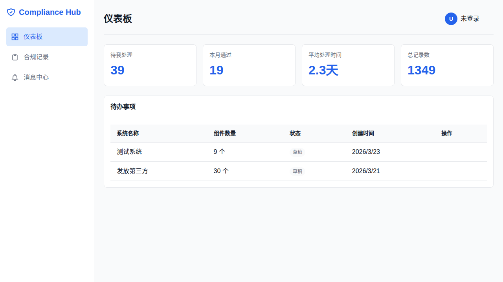
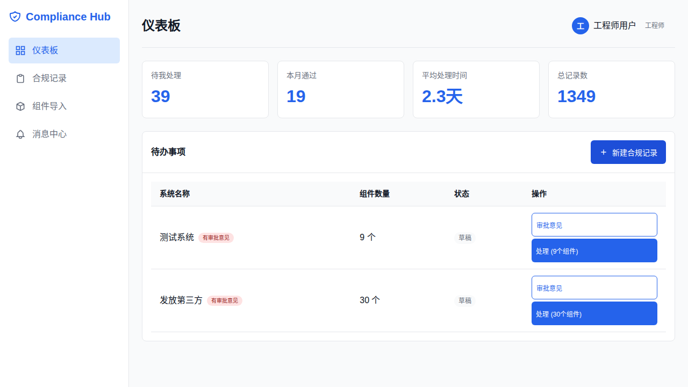
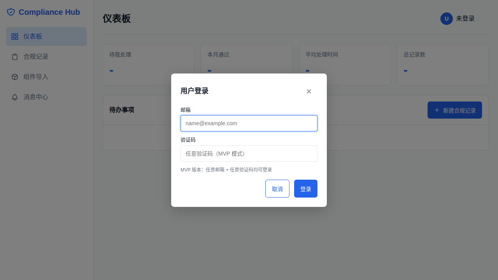

# Compliance Hub

软件合规管理系统 - 内部工具

## 系统截图

### 仪表盘（登录后）


### 合规记录页面


### 初始状态


## 功能特性

- **Black Duck 集成** - 自动拉取和解析组件报告
- **组件复用** - 相同组件自动匹配历史合规结论
- **在线审批流** - 研发→安全→法务完整流程
- **审计追溯** - 完整审批历史记录
- **角色权限** - 工程师/安全评审/法务审批/管理员四级权限
- **前端 UI** - 简洁易用的 Web 界面，支持快速切换用户

## 快速开始

### 环境要求

- Python 3.11+
- PostgreSQL 14+

### 一键启动

```bash
cd compliance-hub
chmod +x start.sh
./start.sh
```

访问 http://localhost:8000 查看前端页面
访问 http://localhost:8000/docs 查看 API 文档

### 手动安装

```bash
# 1. 创建虚拟环境
python3 -m venv venv
source venv/bin/activate

# 2. 安装依赖
pip install -r requirements.txt

# 3. 配置环境变量
cp .env.example .env
# 编辑 .env 配置数据库 URL

# 4. 初始化数据库
alembic upgrade head

# 5. 启动服务
uvicorn app.main:app --reload --host 0.0.0.0 --port 8000
```

## 项目结构

```
compliance-hub/
├── app/
│   ├── models/          # SQLAlchemy 模型
│   ├── schemas/         # Pydantic Schema
│   ├── services/        # 业务逻辑
│   ├── routes/          # API 路由
│   ├── utils/           # 工具函数
│   ├── middleware/      # 中间件
│   └── main.py          # 应用入口
├── static/              # 前端静态文件
├── migrations/          # 数据库迁移
├── tests/               # 测试
├── create_test_users.py # 创建测试用户脚本
└── requirements.txt     # 依赖
```

## API 端点

| 端点 | 描述 |
|------|------|
| POST /api/auth/login | 登录 |
| GET /api/auth/me | 获取当前用户 |
| GET /api/components | 组件列表 |
| POST /api/components/blackduck | 上传 Black Duck 报告 |
| POST /api/components/match | 组件匹配检查 |
| GET /api/compliance-records | 合规记录列表 |
| POST /api/compliance-records/:id/submit | 提交审批 |
| POST /api/compliance-records/:id/approve | 审批通过 |
| POST /api/compliance-records/:id/reject | 审批驳回 |
| GET /api/approvals/:id/history | 审批历史 |
| GET /api/dashboard/todo | 我的待办 |
| GET /api/dashboard/stats | 统计信息 |

## 状态机

```
DRAFT ──▶ PENDING_SECURITY ──▶ PENDING_LEGAL ──▶ APPROVED
  ▲              │                    │
  │              │                    │
  └──────────────┴────────────────────┘
         驳回/要求修改
```

## 开发

### 运行测试

```bash
# 运行所有测试
pytest

# 运行测试并生成覆盖率报告
pytest --cov=app --cov-report=html

# 运行特定测试文件
pytest tests/test_auth.py
pytest tests/test_components.py
pytest tests/test_records.py
```

### 创建测试用户

```bash
# 创建 4 个测试角色用户（工程师/安全/法务/管理员）
python create_test_users.py
```

### 代码检查

```bash
black .
ruff check .
```

## License

Internal Use Only
